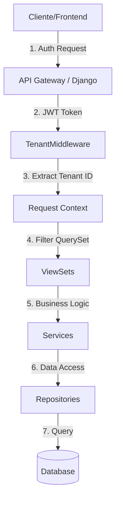

# 🔄 Flujo del Sistema y Guía de Pruebas

Este documento detalla la arquitectura de flujos de la plataforma HR Solution y cómo probar cada componente paso a paso.

---

## 1. Arquitectura de Flujos

El sistema opera bajo una arquitectura **Multitenant** con aislamiento lógico. El flujo de datos sigue esta jerarquía:



### Dependencias Críticas

1.  **Usuarios (Users)**: Entidad base. Un usuario puede existir sin tenant, pero no puede hacer nada operativo.
2.  **Tenants**: Entidad organizativa. Requiere un usuario creador (Admin).
3.  **Membresías**: Vinculan Usuarios con Tenants. Definen permisos (Admin/Member).
4.  **Reclutamiento**: Depende estrictamente de un Tenant activo.

---

## 2. Guía de Pruebas Paso a Paso

### Prerrequisitos
- Base de datos corriendo (`docker-compose up db`)
- Migraciones aplicadas (`python manage.py migrate`)
- Servidor corriendo (`python manage.py runserver`)

### Flujo 1: Onboarding (Auth & Tenant)

Este es el flujo inicial para cualquier nuevo cliente.

1.  **Registro de Usuario**:
    - `POST /api/users/`
    - Crea el usuario en el sistema global.
2.  **Obtención de Token (Login)**:
    - `POST /api/token/`
    - Retorna `access` y `refresh` tokens.
    - **Importante**: Copiar el `access` token para los siguientes pasos.
3.  **Crear Tenant (Empresa)**:
    - `POST /api/tenants/`
    - Header: `Authorization: Bearer <token>`
    - Body: `{"name": "Mi Empresa", "plan": "pro"}`
    - **Resultado**: Crea el tenant y asigna al usuario como ADMIN automáticamente.
    - **Nota**: El response devuelve el `id` del tenant. **Guárdalo**, es tu `tenant_id`.

### Flujo 2: Gestión de Equipo

1.  **Invitar Miembro**:
    - Primero, el otro usuario debe registrarse (Flujo 1.1).
    - `POST /api/tenants/{tenant_id}/add_member/`
    - Body: `{"user_id": 2, "role": "member"}`
2.  **Listar Tenants**:
    - `GET /api/tenants/`
    - Muestra solo los tenants donde eres miembro.

### Flujo 3: Proceso de Reclutamiento

**Nota Crítica**: Para estos requests, el sistema necesita saber en qué tenant estás operando. El `TenantMiddleware` extrae esto del token JWT si el claim `tenant_id` está presente.
*Si el token no tiene tenant_id (implementación actual simple), debes pasar el tenant_id en el body o query params según la implementación específica, o el backend lo infiere del usuario si solo tiene un tenant.*

1.  **Crear Vacante**:
    - `POST /api/recruitment/vacancies/`
    - Body: `{"title": "DevOps Engineer", "description": "..."}`
2.  **Publicar Vacante**:
    - `POST /api/recruitment/vacancies/{id}/publish/`
    - Cambia estado a `PUBLISHED`.
3.  **Postulación (Pública)**:
    - `POST /api/recruitment/applications/`
    - **No requiere Auth**.
    - Body: `{"vacancy_id": 1, "email": "candidato@test.com", "first_name": "Juan"}`
    - **Resultado**: Crea el Candidato (si no existe) y la Application.

---

## 3. Estructura de Datos para Pruebas

### Usuario Admin
```json
{
    "username": "admin_user",
    "email": "admin@company.com",
    "password": "securepassword123",
    "first_name": "Admin",
    "last_name": "User"
}
```

### Tenant
```json
{
    "name": "Tech Solutions Inc.",
    "slug": "tech-solutions",
    "plan": "enterprise",
    "max_users": 10
}
```

### Vacante
```json
{
    "title": "Senior Python Developer",
    "description": "Expert in Django and DDD.",
    "requirements": "5+ years experience.",
    "salary_min": 4000.00,
    "salary_max": 6000.00,
    "currency": "USD",
    "is_remote": true
}
```

### Postulación
```json
{
    "vacancy_id": 1,
    "first_name": "John",
    "last_name": "Doe",
    "email": "john.doe@example.com",
    "linkedin_url": "https://linkedin.com/in/johndoe",
    "source": "linkedin"
}
```
