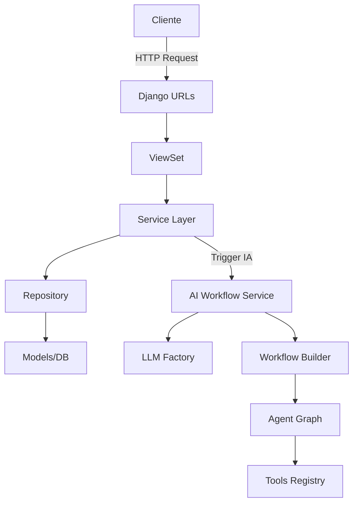
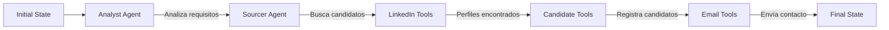
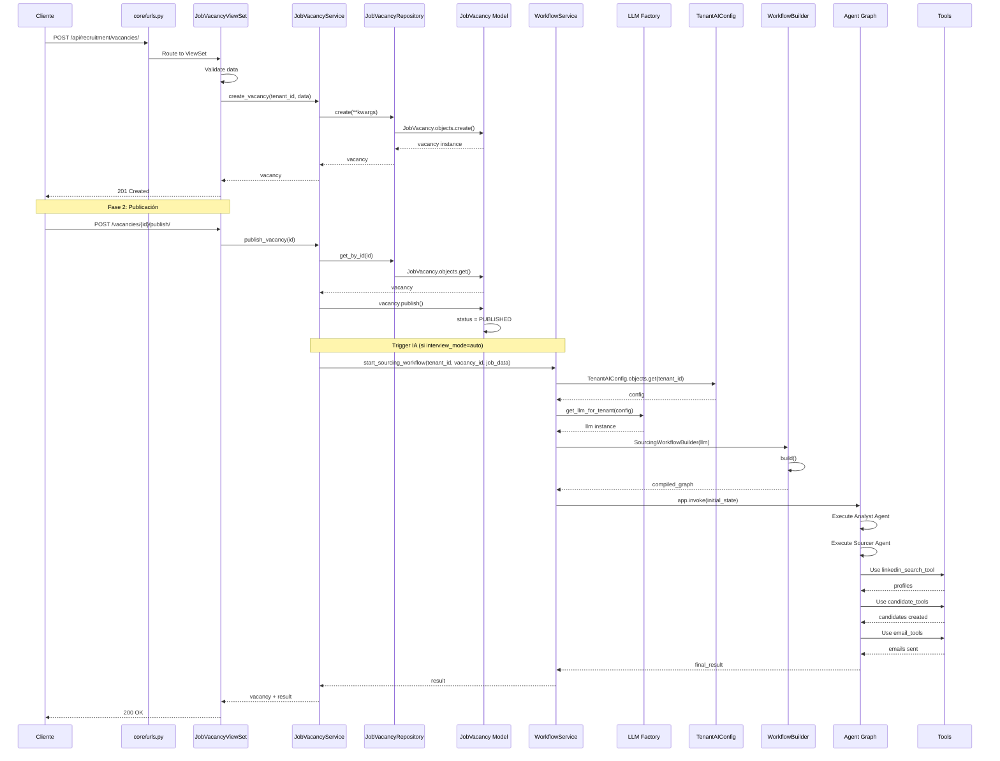

# Flujo de Peticiones del Sistema de IA

Este documento describe el flujo completo de una petición desde que el cliente define una vacante hasta que se construye y ejecuta el grafo de agentes de IA.

---

## Tabla de Contenidos

1. [Visión General](#visión-general)
2. [Flujo Completo Paso a Paso](#flujo-completo-paso-a-paso)
3. [Diagrama de Secuencia](#diagrama-de-secuencia)
4. [Detalle de Archivos por Capa](#detalle-de-archivos-por-capa)
5. [Flujo de Datos](#flujo-de-datos)

---

## Visión General

El sistema maneja dos flujos principales:
1. **Creación de Vacante**: Desde la definición inicial hasta su publicación
2. **Ejecución de IA**: Desde el trigger de IA hasta la ejecución del grafo de agentes



---

## Flujo Completo Paso a Paso

### Fase 1: Creación de Vacante

#### 1.1 Request HTTP del Cliente

**Archivo**: Cliente externo (Frontend, Postman, etc.)

```http
POST /api/recruitment/vacancies/
Content-Type: application/json
Authorization: Bearer <JWT_TOKEN>

{
  "title": "Senior Python Developer",
  "description": "Buscamos desarrollador Python...",
  "requirements": "5+ años experiencia...",
  "interview_mode": "auto",
  "location": "Remote",
  "salary_min": 80000,
  "salary_max": 120000
}
```

#### 1.2 Enrutamiento Django

**Archivo**: [`core/urls.py`](file:///opt/projects/hr-solution/core/urls.py)

```python
# Línea 24
path('api/recruitment/', include('apps.recruitment.urls')),
```

**Archivo**: [`apps/recruitment/urls.py`](file:///opt/projects/hr-solution/apps/recruitment/urls.py)

```python
# Líneas 11-12
router = DefaultRouter()
router.register(r'vacancies', JobVacancyViewSet, basename='vacancy')
```

**Flujo**: 
- Request llega a Django
- URL dispatcher busca coincidencia en `core/urls.py`
- Redirige a `apps.recruitment.urls`
- Router de DRF mapea a `JobVacancyViewSet`

---

#### 1.3 ViewSet (Capa de Presentación)

**Archivo**: [`apps/recruitment/views/job_vacancy_views.py`](file:///opt/projects/hr-solution/apps/recruitment/views/job_vacancy_views.py)

```python
# Líneas 39-57
def create(self, request: Request) -> Response:
    serializer = self.get_serializer(data=request.data)
    serializer.is_valid(raise_exception=True)
    
    try:
        vacancy = self.service.create_vacancy(
            tenant_id=request.tenant_id,
            user_id=request.user.id,
            **serializer.validated_data
        )
        return Response(
            JobVacancySerializer(vacancy).data,
            status=status.HTTP_201_CREATED
        )
    except ValueError as e:
        return Response(
            {'error': str(e)},
            status=status.HTTP_400_BAD_REQUEST
        )
```

**Responsabilidades**:
- Validación de datos con serializers
- Autenticación/Autorización
- Extracción de `tenant_id` del request
- Llamada al Service Layer
- Formateo de respuesta HTTP

---

#### 1.4 Service Layer (Lógica de Negocio)

**Archivo**: [`apps/recruitment/services/job_vacancy_service.py`](file:///opt/projects/hr-solution/apps/recruitment/services/job_vacancy_service.py)

```python
# Líneas 30-65
@transaction.atomic
def create_vacancy(
    self,
    tenant_id: str,
    title: str,
    description: str,
    user_id: int,
    **extra_fields: Any
) -> JobVacancy:
    # 1. Validar que el tenant existe
    tenant = self.tenant_repository.get_by_id(tenant_id)
    if not tenant:
        raise ValueError("El tenant no existe.")
    
    # 2. Crear vacante en el repositorio
    return self.repository.create(
        tenant=tenant,
        title=title,
        description=description,
        created_by_id=user_id,
        **extra_fields
    )
```

**Responsabilidades**:
- Validaciones de negocio
- Coordinación entre repositorios
- Transacciones atómicas
- Lógica de dominio

---

#### 1.5 Repository Layer (Acceso a Datos)

**Archivo**: [`apps/recruitment/repositories/job_vacancy_repository.py`](file:///opt/projects/hr-solution/apps/recruitment/repositories/)

```python
def create(self, **kwargs) -> JobVacancy:
    return JobVacancy.objects.create(**kwargs)
```

**Responsabilidades**:
- Abstracción de acceso a datos
- Queries a la base de datos
- Operaciones CRUD

---

#### 1.6 Model Layer (Persistencia)

**Archivo**: [`apps/recruitment/models/job_vacancy.py`](file:///opt/projects/hr-solution/apps/recruitment/models/job_vacancy.py)

```python
# Líneas 15-156
class JobVacancy(models.Model):
    tenant = models.ForeignKey(Tenant, ...)
    title = models.CharField(max_length=255, ...)
    description = models.TextField(...)
    requirements = models.TextField(...)
    interview_mode = models.CharField(
        choices=InterviewMode.choices,
        default=InterviewMode.AUTO
    )
    # ... más campos
```

**Responsabilidades**:
- Definición de esquema
- Validaciones a nivel de modelo
- Métodos de dominio (`publish()`, `close()`)

---

### Fase 2: Publicación de Vacante (Trigger de IA)

#### 2.1 Request de Publicación

```http
POST /api/recruitment/vacancies/{id}/publish/
Authorization: Bearer <JWT_TOKEN>
```

#### 2.2 ViewSet Action

**Archivo**: [`apps/recruitment/views/job_vacancy_views.py`](file:///opt/projects/hr-solution/apps/recruitment/views/job_vacancy_views.py)

```python
# Líneas 59-65
@action(detail=True, methods=['post'])
def publish(self, request, pk=None):
    vacancy = self.service.publish_vacancy(pk)
    if not vacancy:
        return Response(status=status.HTTP_404_NOT_FOUND)
    return Response(JobVacancySerializer(vacancy).data)
```

#### 2.3 Service - Publicación

**Archivo**: [`apps/recruitment/services/job_vacancy_service.py`](file:///opt/projects/hr-solution/apps/recruitment/services/job_vacancy_service.py)

```python
# Líneas 68-83
@transaction.atomic
def publish_vacancy(self, vacancy_id: int) -> JobVacancy | None:
    vacancy = self.repository.get_by_id(vacancy_id)
    if not vacancy:
        return None
    
    vacancy.publish()
    return vacancy
```

#### 2.4 Model - Cambio de Estado

**Archivo**: [`apps/recruitment/models/job_vacancy.py`](file:///opt/projects/hr-solution/apps/recruitment/models/job_vacancy.py)

```python
# Líneas 146-149
def publish(self) -> None:
    """Publica la vacante."""
    self.status = JobStatus.PUBLISHED
    self.save(update_fields=["status", "updated_at"])
```

> **Nota**: En este punto, si `interview_mode == "auto"`, se debería disparar el workflow de IA. Actualmente esto debe implementarse como un signal o llamada explícita.

---

### Fase 3: Ejecución del Workflow de IA

#### 3.1 Trigger del Workflow

**Ubicación sugerida**: Signal post-save o llamada explícita desde el service

```python
# Ejemplo de implementación futura
from apps.ai_core.services.workflow_service import start_sourcing_workflow

# Después de publicar la vacante
if vacancy.interview_mode == InterviewMode.AUTO:
    job_data = {
        "title": vacancy.title,
        "description": vacancy.description,
        "requirements": vacancy.requirements,
        "location": vacancy.location
    }
    
    result = start_sourcing_workflow(
        tenant_id=str(vacancy.tenant.id),
        vacancy_id=vacancy.id,
        job_data=job_data
    )
```

---

#### 3.2 Workflow Service (Orquestador)

**Archivo**: [`apps/ai_core/services/workflow_service.py`](file:///opt/projects/hr-solution/apps/ai_core/services/workflow_service.py)

```python
# Líneas 7-44
def start_sourcing_workflow(tenant_id: str, vacancy_id: int, job_data: dict):
    """Orquesta la ejecución del workflow."""
    
    # 1. Obtener Configuración del Tenant
    try:
        config = TenantAIConfig.objects.get(tenant_id=tenant_id)
    except TenantAIConfig.DoesNotExist:
        raise ValueError("Tenant no tiene configuración de IA")
    
    # 2. Instanciar el LLM correcto (Factory)
    llm = get_llm_for_tenant(config)
    
    # 3. Construir el Grafo
    builder = SourcingWorkflowBuilder(llm=llm)
    app = builder.build()
    
    # 4. Configurar Monitoreo
    monitor = get_workflow_monitor(
        trace_name=f"Sourcing Vacancy {vacancy_id}",
        tenant_id=str(tenant_id)
    )
    
    # 5. Estado Inicial
    initial_state = {
        "vacancy_id": vacancy_id,
        "context": job_data,
        "messages": []
    }
    
    # 6. Ejecutar
    result = app.invoke(
        initial_state,
        config={"callbacks": monitor}
    )
    
    return result
```

**Responsabilidades**:
- Obtener configuración de IA del tenant
- Instanciar el LLM apropiado
- Construir el grafo de agentes
- Configurar monitoreo
- Ejecutar el workflow

---

#### 3.3 Configuración del Tenant

**Archivo**: [`apps/tenants/models/tenant_ai_config.py`](file:///opt/projects/hr-solution/apps/tenants/models/tenant_ai_config.py)

```python
# Líneas 15-156
class TenantAIConfig(models.Model):
    tenant = models.OneToOneField(Tenant, ...)
    provider = models.CharField(
        choices=AIProvider.choices,
        default=AIProvider.OPENAI
    )
    api_key = models.CharField(max_length=500, ...)
    model_name = models.CharField(default="gpt-4", ...)
    temperature = models.FloatField(default=0.7, ...)
    max_tokens = models.PositiveIntegerField(default=2000, ...)
```

**Datos recuperados**:
- Proveedor de IA (OpenAI, Claude, etc.)
- API Key del tenant (BYOK)
- Modelo específico
- Parámetros de configuración

---

#### 3.4 LLM Factory (Patrón Factory)

**Archivo**: [`apps/ai_core/adapters/llm_factory.py`](file:///opt/projects/hr-solution/apps/ai_core/adapters/llm_factory.py)

```python
# Líneas 8-36
def get_llm_for_tenant(tenant_config: TenantAIConfig):
    """
    Devuelve una instancia de LangChain ChatModel configurada
    según las preferencias del tenant.
    """
    api_key = tenant_config.api_key
    provider = tenant_config.provider
    model_name = tenant_config.model_name
    
    # Lógica de Fallback
    if provider == AIProvider.PLATFORM_DEFAULT:
        provider = AIProvider.OPENAI
        api_key = settings.OPENAI_API_KEY_GLOBAL
    
    # 1. OpenAI
    if provider == AIProvider.OPENAI:
        final_key = api_key or settings.OPENAI_API_KEY_GLOBAL
        return ChatOpenAI(api_key=final_key, model=model_name, temperature=0)
    
    # 2. Claude
    elif provider == AIProvider.CLAUDE:
        final_key = api_key or settings.CLAUDE_API_KEY_GLOBAL
        return ChatAnthropic(
            api_key=final_key,
            model=model_name,
            temperature=0
        )
    
    raise ValueError(f"Proveedor de IA no soportado: {provider}")
```

**Responsabilidades**:
- Instanciar el LLM correcto según configuración
- Manejar fallback a configuración global
- Soportar múltiples proveedores (OpenAI, Claude)

---

#### 3.5 Monitoring Adapter

**Archivo**: [`apps/ai_core/adapters/monitoring.py`](file:///opt/projects/hr-solution/apps/ai_core/adapters/monitoring.py)

```python
# Líneas 7-35
def get_workflow_monitor(
    trace_name: str,
    tenant_id: str,
    session_id: str = None
) -> list:
    """Devuelve una lista de Callbacks para monitorear la ejecución."""
    callbacks = []
    
    # 1. Logs de consola en desarrollo
    if settings.DEBUG:
        callbacks.append(StdOutCallbackHandler())
    
    # 2. Hook para Langfuse (producción)
    # Código comentado para integración futura
    
    return callbacks
```

**Responsabilidades**:
- Configurar callbacks de monitoreo
- Logs en desarrollo
- Integración con herramientas de observabilidad (Langfuse)

---

#### 3.6 Workflow Builder (Construcción del Grafo)

**Archivo**: [`apps/ai_core/workflows/sourcing_graph.py`](file:///opt/projects/hr-solution/apps/ai_core/workflows/sourcing_graph.py)

```python
# Líneas 15-64
class SourcingWorkflowBuilder:
    def __init__(self, llm):
        self.llm = llm
    
    def build(self):
        # Configuración de herramientas por agente
        agent_configs = {
            "analyst": [],
            "sourcer": ["linkedin_search_tool"],
        }
        
        workflow = StateGraph(AgentState)
        
        # Nodos
        workflow.add_node(
            "analyst", self._create_node("analyst", agent_configs)
        )
        workflow.add_node(
            "sourcer", self._create_node("sourcer", agent_configs)
        )
        
        # Edges (flujo)
        workflow.set_entry_point("analyst")
        workflow.add_edge("analyst", "sourcer")
        workflow.add_edge("sourcer", END)
        
        return workflow.compile()
    
    def _create_node(self, agent_name, configs):
        def node_func(state):
            # Lógica de invocación del agente
            # Aquí se ejecuta el LLM con las herramientas asignadas
            return {"messages": [f"Agente {agent_name} ejecutado"]}
        
        return node_func
```

**Responsabilidades**:
- Definir estructura del grafo (nodos y edges)
- Asignar herramientas a cada agente
- Configurar flujo de ejecución
- Compilar el grafo para ejecución

---

#### 3.7 Agent State (Estado Compartido)

**Archivo**: [`apps/ai_core/workflows/sourcing_graph.py`](file:///opt/projects/hr-solution/apps/ai_core/workflows/sourcing_graph.py)

```python
# Líneas 8-12
class AgentState(TypedDict):
    messages: List[str]
    vacancy_id: int
    context: dict
    final_output: dict
```

**Datos en el estado**:
- `messages`: Historial de mensajes entre agentes
- `vacancy_id`: ID de la vacante en proceso
- `context`: Datos de la vacante (título, descripción, requisitos)
- `final_output`: Resultado final del workflow

---

#### 3.8 Tools Registry (Herramientas Disponibles)

**Archivo**: [`apps/ai_core/tools/registry.py`](file:///opt/projects/hr-solution/apps/ai_core/tools/registry.py)

Herramientas disponibles en el sistema:

**LinkedIn Tools** ([`linkedin_tools.py`](file:///opt/projects/hr-solution/apps/ai_core/tools/linkedin_tools.py)):
- `search_linkedin_profiles`: Búsqueda de perfiles
- `get_profile_details`: Detalles de perfil
- `send_connection_request`: Enviar solicitud

**Candidate Tools** ([`candidate_tools.py`](file:///opt/projects/hr-solution/apps/ai_core/tools/candidate_tools.py)):
- `create_candidate_record`: Crear registro de candidato
- `update_candidate_status`: Actualizar estado
- `get_candidate_info`: Obtener información

**Email Tools** ([`email_tools.py`](file:///opt/projects/hr-solution/apps/ai_core/tools/email_tools.py)):
- `send_recruitment_email`: Enviar email de reclutamiento
- `send_follow_up_email`: Email de seguimiento

---

#### 3.9 Ejecución del Grafo



**Flujo de ejecución**:

1. **Estado inicial** se pasa al grafo
2. **Analyst Agent** (primer nodo):
   - Recibe contexto de la vacante
   - Analiza requisitos
   - Genera criterios de búsqueda
   - Actualiza el estado

3. **Sourcer Agent** (segundo nodo):
   - Recibe estado del analyst
   - Usa `linkedin_search_tool` para buscar candidatos
   - Filtra y evalúa perfiles
   - Crea registros con `candidate_tools`
   - Envía emails con `email_tools`
   - Actualiza estado final

4. **Estado final** se retorna al workflow service

---

## Diagrama de Secuencia



---

## Detalle de Archivos por Capa

### Capa de Routing

| Archivo | Líneas Clave | Responsabilidad |
|---------|--------------|-----------------|
| [`core/urls.py`](file:///opt/projects/hr-solution/core/urls.py) | 24 | Routing principal a apps |
| [`apps/recruitment/urls.py`](file:///opt/projects/hr-solution/apps/recruitment/urls.py) | 11-13 | Router DRF para vacancies |

### Capa de Presentación (Views)

| Archivo | Líneas Clave | Responsabilidad |
|---------|--------------|-----------------|
| [`job_vacancy_views.py`](file:///opt/projects/hr-solution/apps/recruitment/views/job_vacancy_views.py) | 39-57 | `create()` - Crear vacante |
| [`job_vacancy_views.py`](file:///opt/projects/hr-solution/apps/recruitment/views/job_vacancy_views.py) | 59-65 | `publish()` - Publicar vacante |
| [`job_vacancy_views.py`](file:///opt/projects/hr-solution/apps/recruitment/views/job_vacancy_views.py) | 67-73 | `close()` - Cerrar vacante |

### Capa de Servicio (Business Logic)

| Archivo | Líneas Clave | Responsabilidad |
|---------|--------------|-----------------|
| [`job_vacancy_service.py`](file:///opt/projects/hr-solution/apps/recruitment/services/job_vacancy_service.py) | 30-65 | `create_vacancy()` - Lógica de creación |
| [`job_vacancy_service.py`](file:///opt/projects/hr-solution/apps/recruitment/services/job_vacancy_service.py) | 68-83 | `publish_vacancy()` - Lógica de publicación |
| [`application_service.py`](file:///opt/projects/hr-solution/apps/recruitment/services/application_service.py) | 52-107 | `apply_to_vacancy()` - Gestión de postulaciones |

### Capa de Repositorio (Data Access)

| Archivo | Responsabilidad |
|---------|-----------------|
| `job_vacancy_repository.py` | CRUD de vacantes |
| [`application_repository.py`](file:///opt/projects/hr-solution/apps/recruitment/repositories/application_repository.py) | CRUD de postulaciones |
| `candidate_repository.py` | CRUD de candidatos |

### Capa de Modelo (Domain)

| Archivo | Líneas Clave | Responsabilidad |
|---------|--------------|-----------------|
| [`job_vacancy.py`](file:///opt/projects/hr-solution/apps/recruitment/models/job_vacancy.py) | 15-156 | Modelo de vacante |
| [`application.py`](file:///opt/projects/hr-solution/apps/recruitment/models/application.py) | 15-102 | Modelo de postulación |
| `candidate.py` | - | Modelo de candidato |

### Capa de IA - Orquestación

| Archivo | Líneas Clave | Responsabilidad |
|---------|--------------|-----------------|
| [`workflow_service.py`](file:///opt/projects/hr-solution/apps/ai_core/services/workflow_service.py) | 7-44 | Orquestador principal del workflow |

### Capa de IA - Configuración

| Archivo | Líneas Clave | Responsabilidad |
|---------|--------------|-----------------|
| [`tenant_ai_config.py`](file:///opt/projects/hr-solution/apps/tenants/models/tenant_ai_config.py) | 15-156 | Configuración de IA por tenant |
| [`llm_factory.py`](file:///opt/projects/hr-solution/apps/ai_core/adapters/llm_factory.py) | 8-36 | Factory de LLM providers |
| [`monitoring.py`](file:///opt/projects/hr-solution/apps/ai_core/adapters/monitoring.py) | 7-35 | Configuración de monitoreo |

### Capa de IA - Workflow

| Archivo | Líneas Clave | Responsabilidad |
|---------|--------------|-----------------|
| [`sourcing_graph.py`](file:///opt/projects/hr-solution/apps/ai_core/workflows/sourcing_graph.py) | 15-64 | Constructor del grafo de agentes |
| [`sourcing_graph.py`](file:///opt/projects/hr-solution/apps/ai_core/workflows/sourcing_graph.py) | 8-12 | Definición del estado compartido |

### Capa de IA - Herramientas

| Archivo | Responsabilidad |
|---------|-----------------|
| [`linkedin_tools.py`](file:///opt/projects/hr-solution/apps/ai_core/tools/linkedin_tools.py) | Herramientas de LinkedIn |
| [`candidate_tools.py`](file:///opt/projects/hr-solution/apps/ai_core/tools/candidate_tools.py) | Herramientas de gestión de candidatos |
| [`email_tools.py`](file:///opt/projects/hr-solution/apps/ai_core/tools/email_tools.py) | Herramientas de email |
| [`registry.py`](file:///opt/projects/hr-solution/apps/ai_core/tools/registry.py) | Registro central de herramientas |

---

## Flujo de Datos

### 1. Datos de Entrada (Request)

```json
{
  "title": "Senior Python Developer",
  "description": "Buscamos desarrollador...",
  "requirements": "5+ años experiencia...",
  "interview_mode": "auto",
  "location": "Remote",
  "salary_min": 80000,
  "salary_max": 120000
}
```

### 2. Datos en Base de Datos (JobVacancy)

```python
JobVacancy(
    id=123,
    tenant_id="tenant-uuid",
    title="Senior Python Developer",
    description="Buscamos desarrollador...",
    requirements="5+ años experiencia...",
    interview_mode="auto",
    status="published",
    location="Remote",
    salary_min=80000.00,
    salary_max=120000.00,
    created_by_id=1,
    created_at="2025-12-04T10:00:00Z",
    updated_at="2025-12-04T10:05:00Z"
)
```

### 3. Datos para el Workflow (job_data)

```python
{
    "title": "Senior Python Developer",
    "description": "Buscamos desarrollador...",
    "requirements": "5+ años experiencia...",
    "location": "Remote"
}
```

### 4. Estado Inicial del Grafo

```python
{
    "vacancy_id": 123,
    "context": {
        "title": "Senior Python Developer",
        "description": "Buscamos desarrollador...",
        "requirements": "5+ años experiencia...",
        "location": "Remote"
    },
    "messages": []
}
```

### 5. Estado Después del Analyst Agent

```python
{
    "vacancy_id": 123,
    "context": {...},
    "messages": [
        "Analista: He identificado los siguientes criterios de búsqueda...",
        "Criterios: Python, 5+ años, Django, FastAPI, Remote"
    ],
    "search_criteria": {
        "keywords": ["Python", "Django", "FastAPI"],
        "experience_years": 5,
        "location": "Remote"
    }
}
```

### 6. Estado Final del Grafo

```python
{
    "vacancy_id": 123,
    "context": {...},
    "messages": [...],
    "search_criteria": {...},
    "final_output": {
        "candidates_found": 15,
        "candidates_contacted": 10,
        "profiles": [
            {
                "name": "John Doe",
                "linkedin_url": "...",
                "email": "john@example.com",
                "match_score": 0.92
            },
            # ... más candidatos
        ]
    }
}
```

---

## Resumen del Flujo

### Creación de Vacante

1. **Cliente** → HTTP POST a `/api/recruitment/vacancies/`
2. **Django URLs** → Enruta a `JobVacancyViewSet`
3. **ViewSet** → Valida y llama a `JobVacancyService.create_vacancy()`
4. **Service** → Valida tenant y llama a `JobVacancyRepository.create()`
5. **Repository** → Crea instancia de `JobVacancy` en BD
6. **Response** → Retorna vacante creada al cliente

### Publicación y Ejecución de IA

7. **Cliente** → HTTP POST a `/api/recruitment/vacancies/{id}/publish/`
8. **ViewSet** → Llama a `JobVacancyService.publish_vacancy()`
9. **Service** → Cambia estado a `PUBLISHED`
10. **Trigger IA** → Si `interview_mode == "auto"`, llama a `start_sourcing_workflow()`
11. **Workflow Service** → Obtiene `TenantAIConfig` de BD
12. **LLM Factory** → Instancia el LLM correcto (OpenAI/Claude)
13. **Workflow Builder** → Construye grafo con agentes y herramientas
14. **Monitoring** → Configura callbacks de observabilidad
15. **Ejecución** → Ejecuta grafo con estado inicial
16. **Analyst Agent** → Analiza requisitos y genera criterios
17. **Sourcer Agent** → Busca candidatos usando herramientas
18. **Tools** → Ejecutan acciones (LinkedIn, Candidate, Email)
19. **Final State** → Retorna resultado al workflow service
20. **Response** → Retorna resultado final al cliente

---

## Puntos de Extensión

### Agregar Nuevos Agentes

1. Crear función de nodo en `SourcingWorkflowBuilder._create_node()`
2. Agregar nodo al grafo con `workflow.add_node()`
3. Configurar edges para definir flujo
4. Asignar herramientas en `agent_configs`

### Agregar Nuevas Herramientas

1. Crear función en `apps/ai_core/tools/`
2. Registrar en `registry.py`
3. Asignar a agentes en `agent_configs`

### Soportar Nuevos Proveedores de IA

1. Agregar opción en `AIProvider` choices
2. Implementar lógica en `llm_factory.get_llm_for_tenant()`
3. Configurar API keys en settings

---

## Notas Importantes

> **BYOK (Bring Your Own Key)**: Cada tenant puede configurar su propia API key y proveedor de IA, permitiendo control total sobre costos y privacidad.

> **Multi-tenancy**: Todo el flujo respeta el aislamiento de datos por tenant, desde la creación de vacantes hasta la ejecución de workflows de IA.

> **Observabilidad**: El sistema está preparado para integración con Langfuse para monitoreo de workflows en producción.

> **Extensibilidad**: La arquitectura basada en grafos permite agregar nuevos agentes y herramientas sin modificar el código existente.

---

## Referencias

- [Arquitectura AI Core](file:///opt/projects/hr-solution/docs/ai_core_architecture.md)
- [Guía de Herramientas](file:///opt/projects/hr-solution/docs/ai_core_tools_guide.md)
- [Especificaciones Técnicas](file:///opt/projects/hr-solution/docs/technical_specifications.md)
